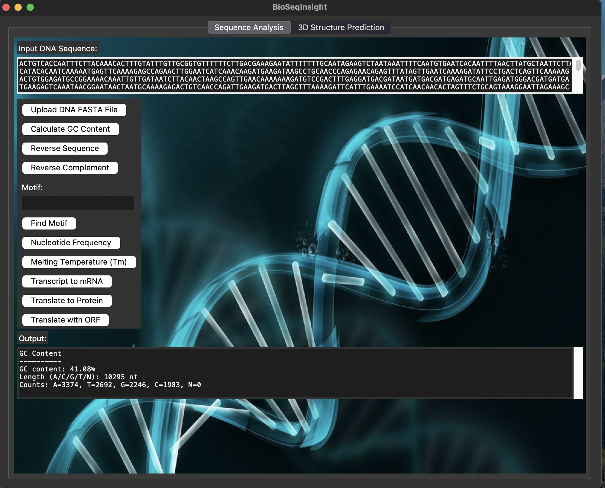
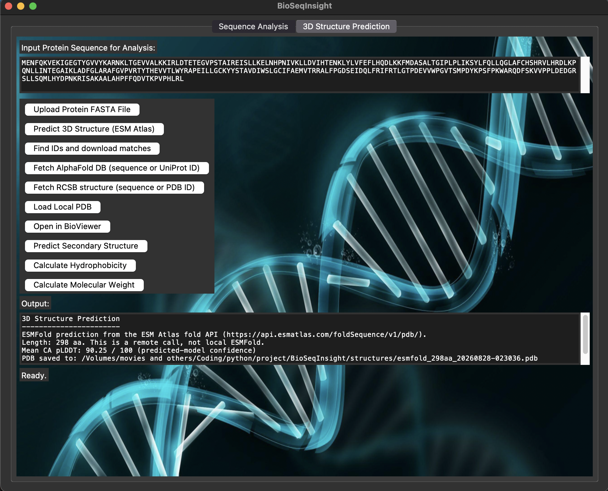
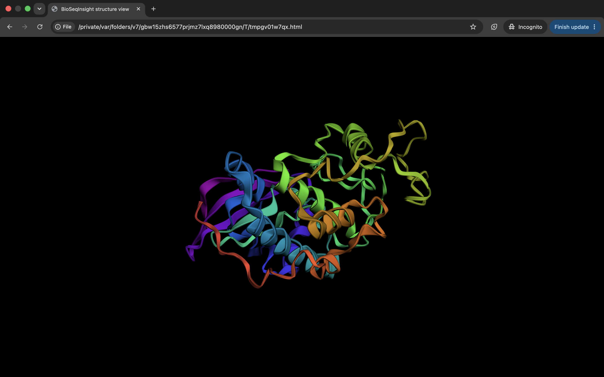

# BioSeqInsight

A Python desktop tool for **local DNA sequence statistics** and **protein structure retrieval**.

It is an integration / teaching helper, not a new folding method. Three-dimensional coordinates come from public services. The app does **not** load ESMFold or AlphaFold weights on your computer.

Manuscript title: *BioSeqInsight: A Python Desktop Platform for DNA Sequence Analysis and Protein Structure Retrieval.*

Presented as an accepted abstract (Reg. DAAS22) at the Regional Statistical Conference 2026, Department of Agricultural and Applied Statistics, Bangladesh Agricultural University, and the Bangladesh Statistical Association. That presentation has **no DOI**.

## What it does

### Interface Previews

**1. Sequence Analysis**

*Figure 1: Sequence Analysis tab computing local GC content and base counts for a 10,295 nt DNA input.*

**2. 3D Structure Prediction**

*Figure 2: Structure tab executing a live ESM Atlas fold of human CDK2 (298 aa) with mean CA pLDDT.*

**3. Integrated 3D Viewer**

*Figure 3: 3Dmol.js cartoon rendering of the predicted CDK2 model.*

### Sequence Analysis (local)

- GC content and A/C/G/T/N counts
- Reverse and reverse complement
- Exact motif search (string matching, not MEME)
- Melting temperature: Wallace rule for ≤20 nt, Biopython nearest-neighbor for longer DNA
- Transcription, translation (NCBI table 1), six-frame ORF search

Teaching check (`examples/short_dna.fasta`, 27 nt): GC **37.04%**, motif `ATG` at 1-based position 4, ORF peptide `MSSKVK`.

### Structure retrieval (network)

- Live fold via the [ESM Atlas](https://api.esmatlas.com/foldSequence/v1/pdb/) API (remote ESMFold; often HTTP 504)
- RCSB sequence search + UniProt mapping
- Download a stored [AlphaFold DB](https://alphafold.ebi.ac.uk/) model
- Download an experimental structure from [RCSB PDB](https://www.rcsb.org/)
- Automatically detects your OS to open the most recently fetched PDB in a local 3D viewer (BioViewer, PyMOL, ChimeraX, or default OS handler)
- Kyte–Doolittle hydropathy and molecular weight (offline)
- Secondary-structure **sketch** only (not Chou–Fasman / GOR)

Predicted models report **pLDDT**. Crystal / EM files report **B-factors (Ų)**. Those are not the same quantity.

## Benchmark (28 August 2026)

25 public proteins, 76–396 aa (`examples/benchmark_25.fasta`):

| Outcome | Count |
|---|---|
| Local statistics | 25/25 |
| RCSB file downloaded | 25/25 |
| AlphaFold DB file downloaded | 24/25 |
| ESM Atlas live fold | 16/25 |
| ESM Atlas HTTP 504 | 9/25 |
| Sequence-search UniProt matched the query ID | 18/25 |

When ESM Atlas answered: 1.9–5.0 s (median 2.2 s), mean CA pLDDT 43.17–94.62 (median 90.38). T4 lysozyme (P00720) has no AFDB entry (404). Six mappings hit a homolog or a chain from a complex (insulin → IDE, GroES → GroEL, Hbβ → Hbα, and others). That is a limitation of RCSB sequence search, not a hidden success.

CDK2 (P24941, 298 aa) three-way example:

| Source | Score |
|---|---|
| ESM Atlas live | pLDDT **90.25** |
| AlphaFold DB v6 | pLDDT **88.46** |
| PDB 1AQ1 | B-factor **24.91 Ų** |

## Install

Needs Python 3.10+ and Tkinter.

```bash
python3 -m venv .venv
source .venv/bin/activate          # Windows: .venv\Scripts\activate
pip install -r requirements.txt
python bio_gui.py
